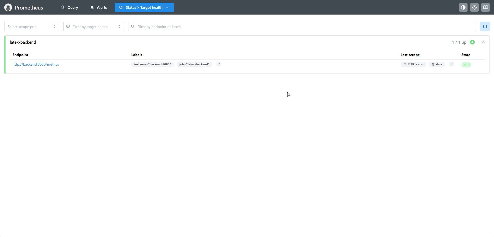
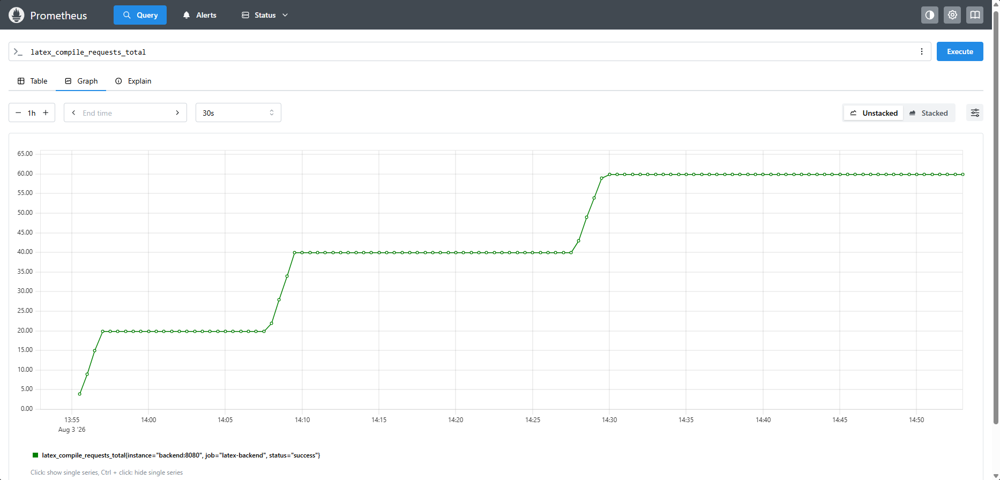
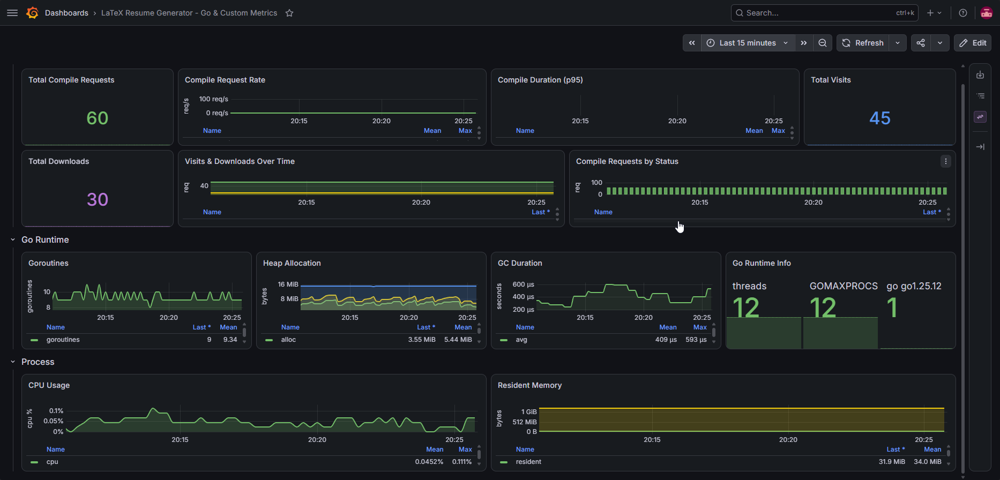
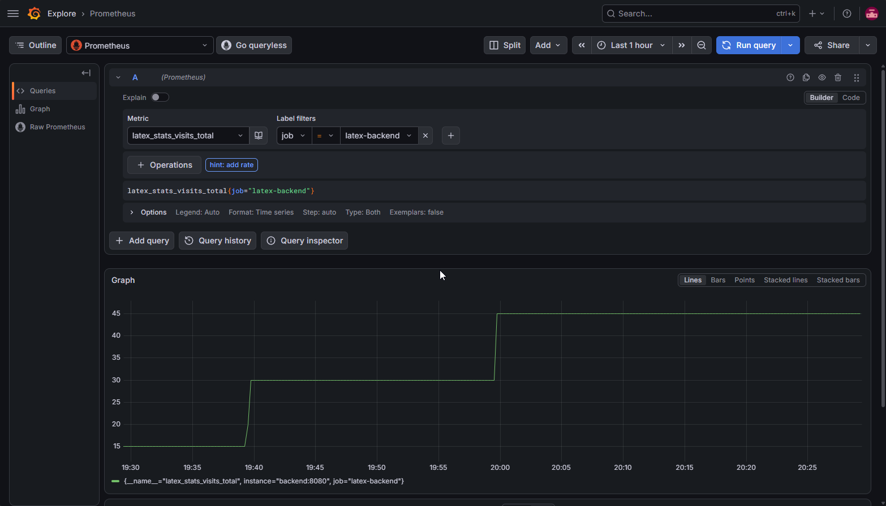
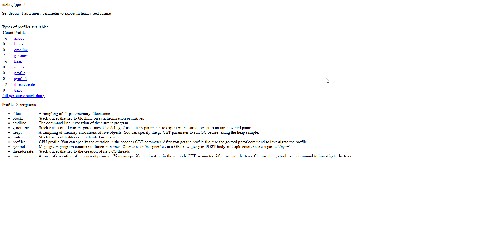
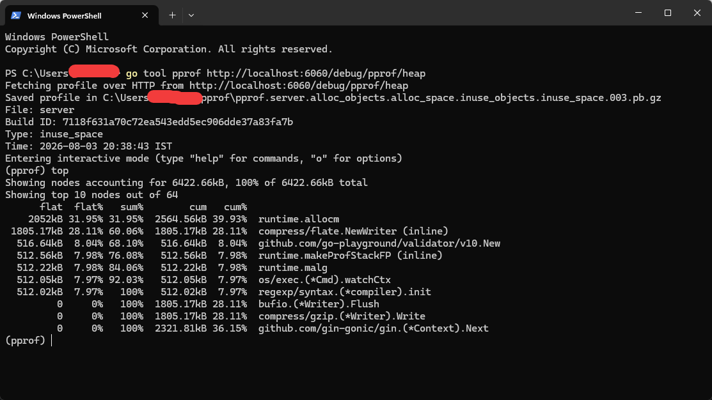

# LaTeX Resume Generator

A production-quality, frontend-first resume builder for IT professionals. Create ATS-friendly, single-page A4 resumes with live preview, drag-and-drop section ordering, and LaTeX/PDF export.

**[Live Demo](https://latex-resume-gen.vercel.app/)**

---

## Features

- **Frontend-First Architecture** -- No authentication, no database, all data stored locally
- **Live Split-Screen Editor** -- Edit on the left, preview on the right with instant updates
- **Drag-and-Drop Section Ordering** -- Reorder resume sections and items with @dnd-kit
- **Show/Hide & Collapse Sections** -- Toggle section visibility and collapse for a cleaner workspace
- **Profile Image Upload** -- Upload and crop profile photos with react-easy-crop
- **Categorized Skills** -- Organize skills by category (Languages, Frameworks, Databases, etc.)
- **Multiple Entries** -- Support multiple experience, education, project, certification, and achievement entries
- **LaTeX Export** -- Generate clean, editable `.tex` files compatible with Overleaf, TeX Live, MiKTeX
- **PDF Export** -- Compile LaTeX to PDF via a Go backend using Tectonic
- **WebSocket Compilation** -- Real-time streaming progress events during LaTeX-to-PDF compilation
- **9 ATS-Friendly Templates** -- Classic, Minimal, Sidebar, Engineering, Google, Compact, Academic, Elegant, Data Science, Two Column
- **Live HTML/CSS Preview** -- Real-time preview renders resume content directly in the browser with no backend dependency for preview
- **Version Management** -- Save, load, and delete resume versions with localStorage persistence
- **Command Palette** -- Ctrl+K power-user interface for quick actions (export, template switch, theme toggle)
- **Keyboard Shortcuts** -- Ctrl+P (PDF), Ctrl+L (LaTeX), Ctrl+D (dark mode), Ctrl+S (save), Ctrl+H (home)
- **Dark/Light Mode** -- Toggle between themes
- **Auto-Save** -- All changes persist to localStorage automatically
- **Responsive UI** -- Modern interface built with shadcn/ui and Tailwind CSS v4
- **Error Tracking** -- Sentry integration with session replay and performance monitoring
- **Multi-Page Warning** -- Alerts when resume exceeds single-page limit with download-anyway option
- **SEO Optimized** -- Open Graph, Twitter Cards, JSON-LD structured data, robots.txt, sitemap.xml

---

## Tech Stack

### Frontend

| Technology | Version | Purpose |
|------------|---------|---------|
| React | 19 | UI framework |
| TypeScript | 6.x | Type safety |
| Vite | 8.x | Build tool & dev server |
| Tailwind CSS | v4 | Utility-first styling |
| shadcn/ui | v4 (Base UI) | Component library |
| Zustand | 5.x | State management |
| React Hook Form | 7.x | Form handling |
| Zod | 4.x | Schema validation |
| @dnd-kit | core 6.x, sortable 10.x | Drag-and-drop |
| Lucide React | 1.x | Icons |
| react-easy-crop | 6.x | Image cropping |
| Sentry React | 10.x | Error tracking & monitoring |

### Backend

| Technology | Purpose |
|------------|---------|
| Go 1.25+ | Runtime |
| Gin Framework | HTTP router |
| Gorilla WebSocket | Real-time compilation streaming |
| modernc.org/sqlite | Pure-Go SQLite driver (stats database) |
| golang.org/x/time/rate | Per-IP token bucket rate limiting |
| prometheus/client_golang | Prometheus metrics collection |
| joho/godotenv | Environment variable loading |
| Tectonic | LaTeX to PDF compiler (v0.16.9) |
| gin-contrib/cors | CORS middleware |
| savetrees (LaTeX) | Automatic single-page compression |

### DevOps

| Technology | Purpose |
|------------|---------|
| Docker | Containerization |
| Docker Compose | Multi-service orchestration |
| Prometheus | Metrics collection & querying |
| Grafana | Monitoring dashboard & visualization |
| Sentry | Error tracking & performance monitoring |
| Render | Cloud deployment (render.yaml blueprint) |

---

## Architecture

```
┌─────────────────────────────────────────────────────────────────┐
│                    Backend Container                             │
│                (golang:1.25-alpine)                             │
│                                                                 │
│   ┌──────────────────────────────────────────────────────────┐  │
│   │                  Gin HTTP Server (:8080)                 │  │
│   │                                                          │  │
│   │  POST /api/compile  ──►  compiler.Compile()             │  │
│   │                                                          │  │
│   │  ┌──────────────────────────────────────────────────┐    │  │
│   │  │           Tectonic (LaTeX compiler)              │    │  │
│   │  │                                                  │    │  │
│   │  │  .tex ──► .pdf  (120s timeout)                   │    │  │
│   │  └──────────────────────────────────────────────────┘    │  │
│   │                                                          │  │
│   │  Response: application/pdf (binary)                      │  │
│   └──────────────────────────────────────────────────────────┘  │
│                                                                 │
└─────────────────────────────────────────────────────────────────┘
```

**Request flow:**

1. Client sends `POST /api/compile` with `{ "latex": "..." }`
2. Go server writes `.tex` to temp directory
3. Tectonic compiles LaTeX to PDF (max 120s)
4. Go server returns PDF binary response

**Key details:**

| Component | Port | Note |
|-----------|------|------|
| Backend (Go) | 8080 (host) → 8080 (container) | Gin server + Tectonic compiler |
| Tectonic | -- | Installed in backend image only |
| Prometheus | 9090 (host) → 9090 (container) | Metrics collection |
| Grafana | 3001 (host) → 3000 (container) | Monitoring dashboards |
| Docker Network | -- | Containers communicate via service names |

---

## Project Structure

```
latex-resume-gen/
├── frontend/
│   ├── src/
│   │   ├── assets/              # Static assets
│   │   ├── components/
│   │   │   ├── editor/          # Resume editor form components
│   │   │   │   ├── EditorPanel.tsx
│   │   │   │   ├── Sidebar.tsx
│   │   │   │   ├── SectionWrapper.tsx
│   │   │   │   ├── PersonalInfoForm.tsx
│   │   │   │   ├── ProfileImageUpload.tsx
│   │   │   │   ├── SummaryForm.tsx
│   │   │   │   ├── ExperienceForm.tsx
│   │   │   │   ├── SkillsForm.tsx
│   │   │   │   ├── ProjectsForm.tsx
│   │   │   │   ├── EducationForm.tsx
│   │   │   │   ├── CertificationsForm.tsx
│   │   │   │   ├── AchievementsForm.tsx
│   │   │   │   ├── PublicationsForm.tsx
│   │   │   │   ├── LanguagesForm.tsx
│   │   │   │   └── CustomSectionsForm.tsx
│   │   │   ├── preview/         # Live resume preview
│   │   │   ├── theme-provider.tsx
│   │   │   └── ui/              # shadcn/ui components
│   │   ├── hooks/               # Custom React hooks
│   │   │   ├── useKeyboardShortcuts.ts
│   │   │   ├── useWebSocketCompile.ts
│   │   │   ├── use-mobile.ts
│   │   │   └── useExportActions.ts
│   │   ├── layouts/
│   │   │   ├── MainLayout.tsx   # Split-screen layout
│   │   │   └── MobileLayout.tsx
│   │   ├── pages/
│   │   │   ├── HomePage.tsx
│   │   │   └── StatsDashboard.tsx
│   │   ├── stores/              # Zustand global state
│   │   │   ├── resume-store.ts
│   │   │   ├── stats-store.ts
│   │   │   └── versions-store.ts
│   │   ├── types/
│   │   │   └── resume.ts        # TypeScript interfaces
│   │   ├── utils/               # Download, export, stats helpers
│   │   │   ├── download.ts
│   │   │   ├── quick-export.ts
│   │   │   └── stats.ts
│   │   ├── templates/           # 9 template directories
│   │   │   ├── academic/
│   │   │   ├── classic/
│   │   │   ├── compact/
│   │   │   ├── datasci/
│   │   │   ├── engineering/
│   │   │   ├── modern/
│   │   │   ├── professional/
│   │   │   ├── sidebar/
│   │   │   ├── twocolumn/
│   │   │   ├── shared.ts
│   │   │   ├── icons.tsx
│   │   │   └── index.ts
│   │   ├── lib/
│   │   │   └── utils.ts         # cn(), generateId(), escapeLatex()
│   │   ├── sentry.ts           # Sentry initialization
│   │   ├── App.tsx
│   │   ├── main.tsx
│   │   └── index.css
│   ├── public/                  # Static assets (favicon, og-image, robots.txt, sitemap.xml)
│   ├── package.json
│   ├── tsconfig.json
│   └── vite.config.ts
├── backend/
│   ├── cmd/
│   │   └── server/
│   │       └── main.go          # Entry point
│   ├── internal/
│   │   ├── compiler/            # LaTeX compilation logic
│   │   ├── handlers/            # HTTP handlers (compile, stats)
│   │   ├── metrics/             # Prometheus metrics
│   │   ├── middleware/           # Rate limiting, admin auth
│   │   ├── stats/               # SQLite database
│   │   └── websocket/           # WebSocket compile streaming
│   ├── Dockerfile
│   ├── .env
│   ├── .dockerignore
│   ├── go.mod
│   └── go.sum
├── prometheus/                   # Prometheus config
├── grafana/                      # Grafana provisioning
├── render.yaml                   # Render deployment blueprint
├── docker-compose.yml
├── .gitignore
└── README.md
```

---

## Getting Started

### Prerequisites

- **Docker** (recommended) — tectonic is included in the backend image
- **Go** 1.25+ (only for local dev without Docker)
- **Tectonic** (only for local dev without Docker)

### Docker Deployment (Recommended)

```bash
docker compose up --build
```

- Backend API: `http://localhost:8080`
- Prometheus: `http://localhost:9090`
- Grafana: `http://localhost:3001` (admin/admin)
- PDF download works out of the box (tectonic is included in the backend image)

### Local Development (requires tectonic installed on host)

#### Frontend

```bash
cd frontend
npm install
npm run dev
```

The dev server runs at `http://localhost:5173` with API proxy to `http://localhost:8080`.

#### Backend

```bash
cd backend
go mod download
go run ./cmd/server
```

The API server runs at `http://localhost:8080`.

> **Note:** PDF export requires [Tectonic](https://tectonic-typesetting.github.io/book/latest/installation.html) installed and available in PATH.

### Profiling (pprof)

pprof is **disabled by default**. Enable it to profile CPU, memory, goroutines, and more.

```bash
# Start backend with pprof enabled
PPROF_ENABLED=true go run ./cmd/server

# Custom port (default: 6060)
PPROF_ENABLED=true PPROF_PORT=7070 go run ./cmd/server
```

Once running, open `http://localhost:6060/debug/pprof/` in your browser to see all available profiles.

**CLI usage:**

```bash
# CPU profile (30 seconds)
go tool pprof http://localhost:6060/debug/pprof/profile?seconds=30

# Heap allocations
go tool pprof http://localhost:6060/debug/pprof/heap

# Goroutine dump
go tool pprof http://localhost:6060/debug/pprof/goroutine
```

**Environment variables:**

| Variable | Default | Description |
|----------|---------|-------------|
| `PPROF_ENABLED` | `false` | Set to `true` to start pprof server |
| `PPROF_PORT` | `6060` | Port for pprof HTTP server |
| `SERVER_PORT` | `8080` | Backend HTTP server port |
| `ALLOWED_ORIGINS` | `http://localhost:5173,http://127.0.0.1:5173,...` | Comma-separated CORS allowed origins |
| `CORS_MAX_AGE` | `12h` | Max age for CORS preflight cache |
| `MAX_REQUEST_SIZE_BYTES` | `5242880` | Max request body size in bytes (5 MB) |
| `RATE_LIMIT_RPS` | `5` | Rate limit: requests per second per IP |
| `RATE_LIMIT_BURST` | `10` | Rate limit: maximum burst size |
| `STATS_DB_PATH` | `/data/stats.db` | Path to SQLite stats database |
| `ADMIN_KEY` | `""` | Required header for `/api/stats/dashboard` endpoint |
| `COMPILE_TIMEOUT_SECONDS` | `120` | LaTeX compilation timeout in seconds |

---

## Screenshots

### Prometheus

| Screenshot | Description |
|------------|-------------|
|  | Targets page showing backend scraping |
|  | PromQL query for compile metrics |

### Grafana

| Screenshot | Description |
|------------|-------------|
|  | Custom dashboard with Go runtime + LaTeX metrics |
|  | Explore view with custom metric queries |

### pprof

| Screenshot | Description |
|------------|-------------|
|  | Available profiles list |
|  | Heap profile analysis in terminal |

---

## API

### POST /api/compile

Compile LaTeX source to PDF.

**Query Parameters:**

| Parameter | Values | Default | Description |
|-----------|--------|---------|-------------|
| `mode` | `attachment`, `inline` | `attachment` | `inline` returns PDF for iframe rendering; `attachment` triggers download |

**Request:**

```json
{
  "latex": "\\documentclass{article}...",
  "mode": "inline"
}
```

**Response:**

- `200 OK` -- `application/pdf` (binary)
  - `X-PDF-Page-Count` header: number of pages in the compiled PDF
- `400 Bad Request`:

```json
{
  "success": false,
  "message": "LaTeX compilation failed.",
  "errors": ["...compiler output..."]
}
```

**Constraints:**

- Max request size: 5 MB
- Timeout: 120 seconds (configurable via `COMPILE_TIMEOUT_SECONDS`)

### GET /api/health

Health check endpoint.

**Response:**

```json
{
  "status": "ok",
  "tectonic": "available",
  "database": "connected"
}
```

Returns `503 Service Unavailable` if tectonic or the stats database is unavailable.

### GET /metrics

Prometheus metrics endpoint. Exposes request counts, duration histograms, and compilation metrics for monitoring.

### GET /api/compile/ws

WebSocket endpoint for real-time LaTeX compilation. Sends compilation progress and PDF binary frames to connected clients.

**Protocol:**
- Client sends JSON: `{ "latex": "...", "profileImage": "..." }`
- Server sends JSON progress messages: `{ "step": "compiling", "message": "Compiling with Tectonic..." }`
- Server sends final PDF as binary WebSocket frame
- Ping/pong heartbeat every 30 seconds for keepalive

### Stats Endpoints

| Method | Path | Description |
|--------|------|-------------|
| `POST` | `/api/stats/visit` | Record a page visit |
| `POST` | `/api/stats/download` | Record a PDF download |
| `GET` | `/api/stats` | Retrieve aggregate stats |
| `GET` | `/api/stats/dashboard` | Dashboard stats (requires `ADMIN_KEY` header) |

---

## Rate Limiting

The `/api/compile` and `/api/compile/ws` endpoints are rate-limited per IP address.

| Variable | Default | Description |
|----------|---------|-------------|
| `RATE_LIMIT_RPS` | `5` | Requests per second per IP |
| `RATE_LIMIT_BURST` | `10` | Maximum burst size |

Exceeding the limit returns `429 Too Many Requests`.

---

## Resume Sections

The editor supports these sections (all drag-and-drop reorderable):

| Section | Multiple Entries | DnD Reorder |
|---------|-----------------|-------------|
| Personal Information | -- | -- |
| Professional Summary | -- | -- |
| Work Experience | Yes | Yes |
| Technical Skills (Categorized) | Yes | Yes |
| Projects | Yes | Yes |
| Education | Yes | Yes |
| Certifications | Yes | -- |
| Achievements | Yes | -- |
| Publications | Yes | -- |
| Languages | Yes | -- |
| Custom Sections | Yes | -- |

---

## Templates

9 ATS-friendly templates designed for IT professionals:

| # | Template | Description |
|---|----------|-------------|
| 1 | Professional ATS | Clean, ATS-optimized layout |
| 2 | Classic | Traditional clean layout |
| 3 | Modern Sidebar | Two-column with sidebar |
| 4 | Engineering Resume | Technical-focused with photo support |
| 5 | Minimal | Ultra-clean, no section rules |
| 6 | Compact One Page | Dense, two-column skills grid |
| 7 | Academic Technical CV | Research-oriented with fancyhdr |
| 8 | Data Science | Analytics-focused layout |
| 9 | Two Column | Standard two-column design |

Each template includes a React preview component, LaTeX template, and configuration file. All templates use the `savetrees` package for automatic single-page compression.

---

## Preview System

The preview system renders resume content directly in the browser using HTML/CSS, providing instant feedback without requiring backend compilation.

**Flow:**
1. User edits resume content in the editor
2. Zustand store updates trigger a re-render of the preview component
3. Resume sections are rendered as styled HTML inside an A4-sized container
4. User sees a live representation of their resume with zoom controls

**Benefits:**
- Instant preview with no compilation delay
- No backend dependency for preview (backend only needed for PDF export)
- Collapsible sidebar with icon-only mode and hover tooltips

**Implementation:**
- `ResumePreview.tsx` renders all resume sections as styled HTML
- A4 page simulation (210x297mm) with realistic margins and page shadow
- Zoom controls (50%, 75%, 100%, 125%, 150%, Fit Width)
- Overflow detection monitors content against soft limits (summary chars, experience entries, project entries)

---

## License

MIT
